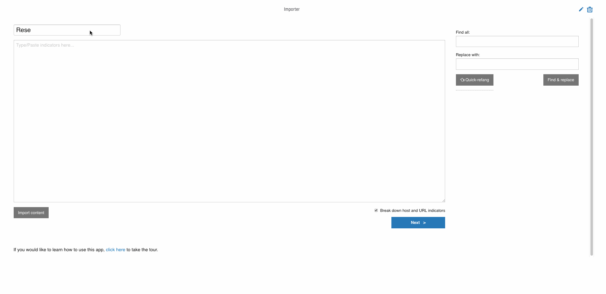
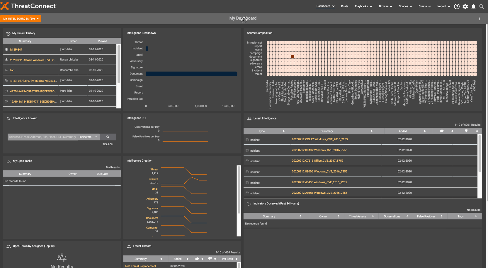

# Indicator Importer

App for quickly and easily getting indicators into the platform and adding metadata around them.



**NOTE:** In the past, this app has been focused on importing unstructured content. Moving forward, this app will be updated to handle both structured (e.g. csv and json) and unstructured content.

## Table of Contents

- [Installation](#installation)
- [Setup](#setup)
  - [First Time Setup](#first-time-setup)
  - [Attributes in Datastore (required)](#attributes-in-datastore-required)
  - [PDF Reader Playbook (optional)](#pdf-reader-playbook-optional)
  - [URL Reader Playbook (optional)](#url-reader-playbook-optional)
  - [OCR Reader Playbook (optional)](#ocr-reader-playbook-optional)
- [Advanced Usage](#advanced-usage)
  - [Custom Metrics](#custom-metrics)
  - [Indicator Profiles](#indicator-profiles)
- [Roadmap](#roadmap)
  - [Current Projects](#current-projects)
  - [Future Projects](#future-projects)
- [Changelog](#changelog)
- [Credits](#credits)

## Installation

To install this app in ThreatConnect, use the following commands:

```
# clone this repo
git clone https://gitlab.com/fhightower-tc/unstructured-indicator-importer.git
cd unstructured-indicator-importer
# package the app
make pack
```

After running these commands, there will be a zip file named `TCS_-_Unstructured_Indicator_Importer.zip` in the top directory of the app which you can install in ThreatConnect.

## Setup

### First Time Setup

Once the app is installed in your TC instance (see administration guide and [Installation section](#installation)), you may have to [add the app to your user account's "spaces"](https://training.threatconnect.com/learn/article/spaces-kb-article):

- When logged into ThreatConnect, click the "Spaces" button at the top menu (not Add Menu Space)
- Click "ADD NEW SPACE" button
- Give the space a name and click "SAVE"
- Click "Add App" button
- Select "TCS - Unstructured Indicator Importer", give it another name (it can be the same name you previously used), and click "SAVE"

Here is a demo setting up the app for the first time:



### Attributes in Datastore (required)

The unstructured indicator importer spaces app pulls attributes from the datastore. Thus, you will need to write a list of attributes like the one in [example_datastore_attributes.json](https://gitlab.com/fhightower-tc/unstructured-indicator-importer/blob/master/example_datastore_attributes.json) to the datastore. This attributes json needs to be added in the following datastore:

```
/organization/app-data/attributes

{"text": "[...<ATTRIBUTES HERE>...]"}
```

There is a playbook to do this [here](https://github.com/ThreatConnect-Inc/threatconnect-playbooks/tree/master/playbooks/TCPB-HT-Unstructured%20Indicator%20Importer%20Attribute%20Recorder).

### PDF Reader Playbook (optional)

To be able to import content from a PDF online, you will need to install a playbook with an HTTP link trigger app that makes a request to the given site, reads the contents as a PDF, and returns the text. This playbook is available [here](https://github.com/ThreatConnect-Inc/threatconnect-playbooks/tree/master/playbooks/TCPB-HT-PDF%20Reader). Once you have installed the playbook, you also need to add the link to the playbook's HTTP link trigger into this app's configuration in the field labeled "Link to PDF Reader Playbook".

### URL Reader Playbook (optional)

To be able to import content from a URL, you will need to install a playbook with the [HTML Text Parser](https://github.com/ThreatConnect-Inc/threatconnect-playbooks/tree/master/apps/TCPB_-_HTML_Text_Parser) playbook app. This playbook is available [here](https://github.com/ThreatConnect-Inc/threatconnect-playbooks/tree/master/playbooks/TCPB-HT-URL%20Reader). Once you have installed the playbook, you also need to add the link to the playbook's HTTP link trigger into this app's configuration in the field labeled "Link to URL Reader Playbook".

### OCR Reader Playbook (optional)

To be able to import content from an image online using [OCR](https://en.wikipedia.org/wiki/Optical_character_recognition), you will need to install a playbook with an HTTP link trigger app that makes a request to the given site, runs OCR on the image, and returns the text. Once you have installed such a playbook, you also need to add the link to the playbook's HTTP link trigger into this app's configuration in the field labeled "Link to OCR Playbook".

## Advanced Usage

### Custom Metrics

Every time this app is run, it posts content to a [custom metric](https://docs.threatconnect.com/en/latest/rest_api/custom_metrics/custom_metrics.html#custom-metrics) endpoint. If you're interested in learning more about this, raise an issue and I can explain it further.

### Indicator Profiles

This app provides a functionality I'm calling "Indicator Profiles". It allows you to form a template made up of attributes and tags that can be applied to indicators in bulk. For example, I may want to have a profile for callback URLs that applies the "C2" tag and an "IP and Host Usage" attribute with a value of "C2". If you have questions, raise and issue and I can add more documentation about how to make these.

## Roadmap

### Current Projects

- Add handling for structured data types (e.g. csv and json) (see our progress [here](https://gitlab.com/fhightower-tc/unstructured-indicator-importer/-/milestones/1))

### Future Projects

- Add ability to edit content (see [#18](https://gitlab.com/fhightower-tc/unstructured-indicator-importer/issues/18))
- Improve deletion functions (see [#19](https://gitlab.com/fhightower-tc/unstructured-indicator-importer/issues/19))
- Build out documentation

## Changelog

### 3.1.1

- The first version since we have started keeping a changelog

## Credits

This package was created with [Cookiecutter](https://github.com/audreyr/cookiecutter) and [Floyd Hightower's Spaces App Template](https://gitlab.com/fhightower-templates/threatconnect-js-spaces-template).
